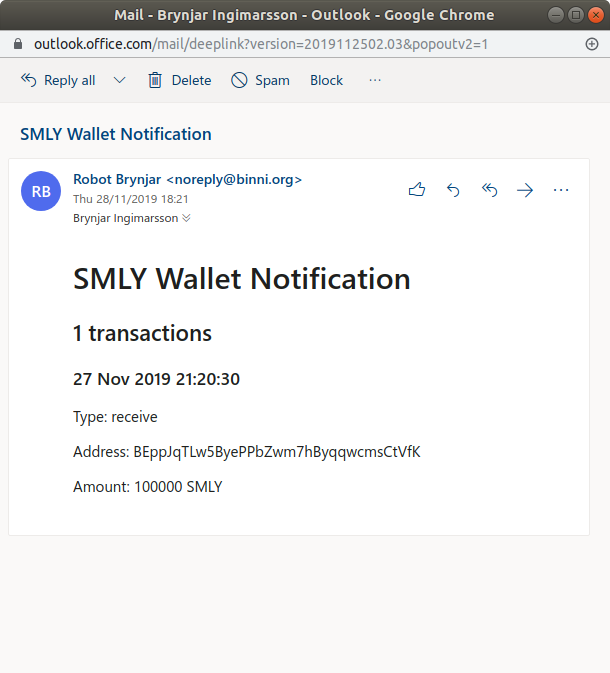

# smlymailer

smlymailer is a script that sends email notifications when your SMLY wallet sends or receives transactions.

## Installation

smlymailer is written in PHP and uses composer to manage dependencies. 

    git clone https://github.com/Ingimarsson/smlymailer.git
    composer install

Create a settings and configure your wallet and mail account.

    cp example.settings.php settings.php

To run the script every 10 minutes you can add the following line to your crontab (use `crontab -e` to open it)

    */10 * * * * /usr/bin/php /path/to/smlymailer/mailer.php

## Example

Here is an example email sent from this script.

